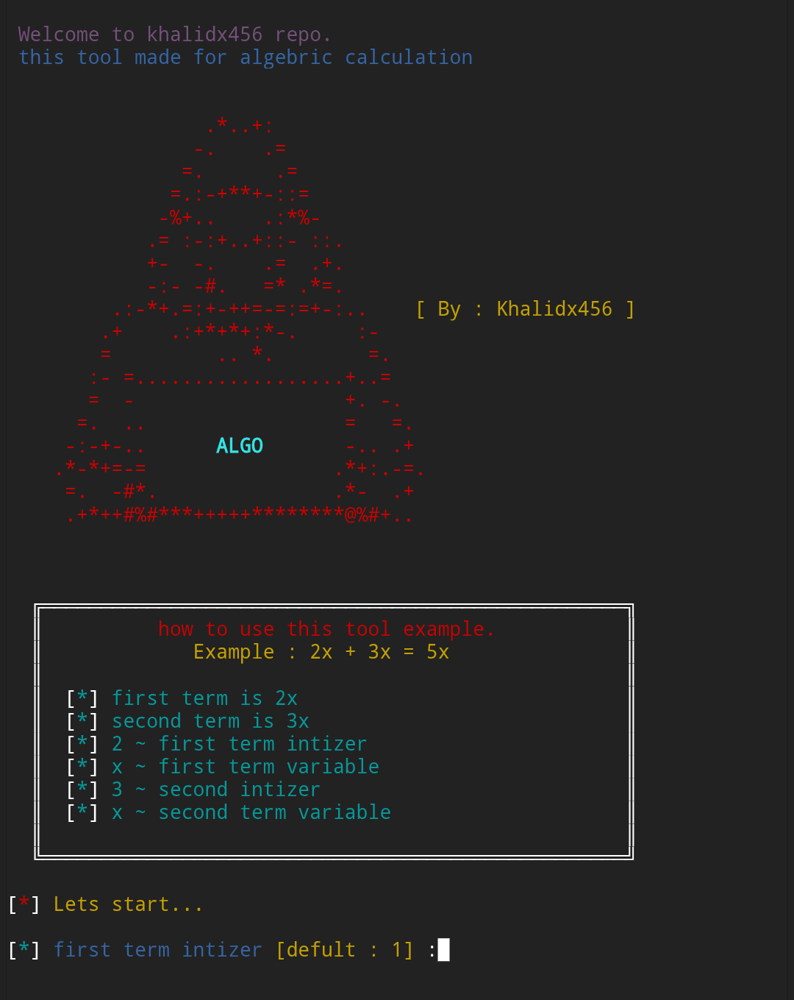

<p align="center">
  
  
  

</p>
<p align="center"><b>A beginners friendly, funny algebraic calculator</b></p>


> [!Warning]
> This tool is intended for legal security testing and educational purposes only. Unauthorized use of Algo Tool or its tools is prohibited and may be illegal. users should always be cautious when running shell scripts. A shell script can contain powerful commands that may delete files, modify system settings, or expose sensitive data if written with harmful instructions. Before executing any script, especially one downloaded from the internet, it is important to open and read its content to ensure it only performs safe actions. Running unknown or unverified shell programs without checking can put the system at risk.


## features 
- beginner friendly
- easy usable
- less time taken
- **automatic process**
- with letest version

## Algebric Calculation :
### How to use this tool 
```
      how to use this tool.
      Example: 2x + 3x = 5x

[*] first term is 2x
[*] second term is 3x
[*] 2~ first term intizer
[*] x first term variable
[*] 3 second intizer
[*] x second term variable
```

### Addition
```
[*] first term intizer [defult : 1] :6
[*] first term variable [required]  :x
[*] select what do you want  [+, -, *] :+
[*] second term intizer [defult : 1] : 9 [*] second term variable [required] : x

[*]  result :   15x
```
### Substraction 
```
[*] first term intizer [defult : 1] :8
[*] first term variable [required]  :x
[*] select what do you want  [+, -, *] : -
[*] second term intizer [defult : 1] : 2
[*] second term variable [required] : x

[*]  result :   6x
```
### Multiplication 
```
[*] first term intizer [defult : 1] :6
[*] first term variable [required]  :x
[*] select what do you want  [+, -, *] :+
[*] second term intizer [defult : 1] : 3
[*] second term variable [required] : x

[*]  result :   18x²
```
### Division 
```
cannot be perform division 
```

## Installation 
- just update and upgrade your Termux
```
apt update && apt upgrade -y
```
- should be install git pakage before installing this tool
```
pkg install git -y
```
- just clone this github repository 
```
git clone https://github.com/Cyber-Tech0/Algo-Tool
```
- just enter in tool dictionary 
```
cd Algo-Tool
```
- and give it executable permission
```
chmod +x algo.sh
```
- for run this tool and setup kali nethunter
```
./algo.sh
```
- On first launch, It'll install the dependencies and that's it is installed.

## Installation (one line)
> [!Tip]
> - if you want to setup 📐 **Algo Tool** in your Android. but you don't know terminal commands then you can copy and paste this commands on your terminal and **follow given below steps.**

- one line commands past on your Termux and just press hit 🎯 enter.

```
apt update && apt upgrade -y && pkg install git -y && git clone https://github.com/Cyber-Tech0/Algo-Tool && cd Algo-Tool && chmod +x algo.sh && ./algo.sh
```

### Termux Commands
> [!NOTE]
> if you don't know about Termux commands. then first of all you want to learn termux commands. if you are are interested then you can download PDF file and easily learn termux commands. [PDF download](https://drive.google.com/file/d/1kYllkvP2s27dxKE5QCRPkA3hNc5kGS1l/view?usp=drivesdk)


### open in cloud shell
<a href="https://shell.cloud.google.com/cloudshell/open?cloudshell_git_repo=https://github.com/Cyber-Tech0/Algo-Tool.git&tutorial=README.md" target="_blank"></a>

<p></p>

<p align="center"><b>Testing on Terminal (on termux CLI)</b></p>

### Algo Tool Interface
</img>

<p></p>
